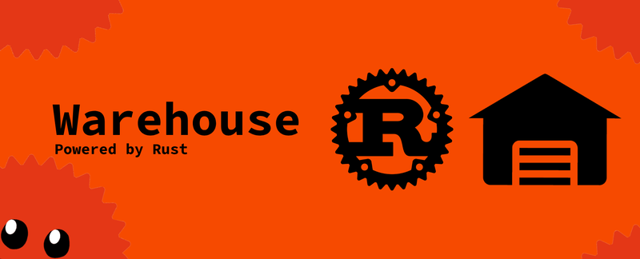

# Warehouse
Secure Rust password storage with string-key encryption

## Features
- Encryption from `magic-crypt` library 
- Comfortable storage for your passwords or another data
- Storing services with the same name, but with different keys
- Storing data in encrypted form in a `warehouse` file, allowing data to be transferred

## Credits
App by [dnllbz](https://github.com/dnllbz) \
License can found in [LICENSE](LICENSE) file
